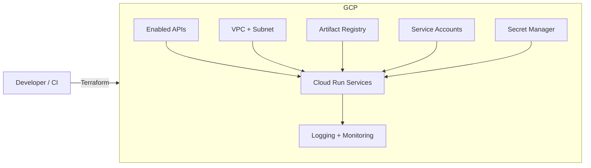

# Architecture overview

This baseline is intended to provide a **Cloud Run-first** platform foundation:

## Key security defaults
- IAM is explicit (least privilege); public access is opt-in.
- Secret Manager module creates *secret containers only* (avoid secret values in Terraform state).
- Optional GitHub Actions Workload Identity Federation avoids long-lived keys.

## Key operational defaults
- Cloud Run `min_instances = 0` to scale-to-zero.
- CI validates formatting and runs `terraform validate` on examples.
